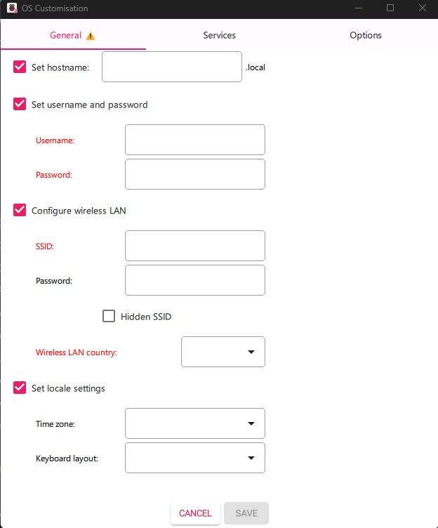

# Pi-hole Setup and Configuration Guide

**Server:** Chicken Little - Win  
**Last Updated:** 2025-12-19

---

## What I Have Learned

Through this project, I have gained valuable insights into:

- **Networking Basics**: Understanding static IP configuration and DNS management.
- **Docker**: Setting up and managing containers for efficient application deployment.
- **Pi-hole**: Deploying and configuring Pi-hole as a network-wide ad blocker.
- **Automation**: Writing scripts to simplify repetitive tasks, such as adding blocklists and managing Docker containers.
- **Troubleshooting**: Diagnosing and resolving common issues related to DNS, Docker, and Pi-hole.

This experience has enhanced my skills in system administration, scripting, and network security.

---

## Table of Contents

1. [Overview](#overview)
2. [Prerequisites](#prerequisites)
3. [Step 1: Initial Setup and IP Configuration](#step-1-initial-setup-and-ip-configuration)
4. [Step 2: Setting Static IP Address](#step-2-setting-static-ip-address)
5. [Step 3: Installing Docker](#step-3-installing-docker)
6. [Step 4: Pi-hole Docker Setup](#step-4-pi-hole-docker-setup)
7. [Step 5: Adding Blocklists](#step-5-adding-blocklists)
8. [Step 6: Configuring DNS Clients](#step-6-configuring-dns-clients)
9. [Troubleshooting](#troubleshooting)
10. [Additional Resources](#additional-resources)
11. [Scripts](#scripts)

---

## Overview

This guide covers the complete installation and configuration of Pi-hole on a Raspberry Pi using Docker. It includes:
- Setting up a static IP address
- Docker and Docker Compose installation
- Pi-hole container deployment
- Adding comprehensive blocklists
- Client DNS configuration

---

## Scripts

To simplify the setup and management of Pi-hole, the following scripts are included in this repository:

1. **[get-docker.sh](scripts/get-docker.sh)**: Automates the installation of Docker.
2. **[docker-compose.yml](scripts/docker-compose.yml)**: Configuration file for deploying Pi-hole using Docker Compose.
3. **[network-config.yaml](scripts/network-config.yaml)**: Example Netplan configuration for setting a static IP address.
4. **[docker-bash.sh](scripts/docker-bash.sh)**: Automates the addition of blocklists in bulk using sqlite3.

Refer to the sections in this guide for detailed usage instructions.

---

## Prerequisites

- Raspberry Pi with Linux OS installed (Ubuntu Server or Raspberry Pi OS)
- Valid internet connection (Ethernet or Wi-Fi)
- SSH access to the Pi
- Basic command line knowledge

**Tip:** When using Raspberry Pi Imager, pre-configure Wi-Fi and credentials using **Ctrl + Shift + X** (Windows) or **Command + Shift + X** (macOS) before flashing.



---

## Step 1: Initial Setup and IP Configuration

### Finding Your Pi's IP Address

**Option 1 - Through Router:**
- Log into your router's web interface (usually `192.168.0.1` or `192.168.1.1`)
- Look for "DHCP Clients" or "Connected Devices"
- Find your Pi's IP address

**Option 2 - Direct Access:**
- Connect a monitor and keyboard to the Pi
- Run the following command:

```bash
ip a
# or
ifconfig
```

### Connecting via SSH

```bash
ssh username@ip_address
```

### Update System

```bash
sudo apt update && sudo apt upgrade -y
```

**SSH Terminal Fix (if needed):**

If you can't use `nano` during an SSH session:

```bash
export TERM=xterm-256color
```

---

## Step 2: Setting Static IP Address

A static IP ensures Pi-hole remains accessible at the same address.

### Method 1: Ubuntu Server (Using Netplan)

**Edit Netplan configuration:**

```bash
sudo nano /etc/netplan/50-cloud-init.yaml
```

**For Wi-Fi connection (wlan0):**

```yaml
network:
  version: 2
  renderer: networkd
  wifis:
    wlan0:
      dhcp4: no
      addresses: [192.168.10.50/24]  # Your chosen static IP
      routes:
        - to: 0.0.0.0/0
          via: 192.168.0.1  # Your router's IP
      nameservers:
        addresses: [1.1.1.1, 8.8.8.8]  # Cloudflare and Google DNS
      access-points:
        "YourSSID":
          password: "YourWiFiPassword"
```

**For Ethernet connection (eth0):**

```yaml
network:
  version: 2
  renderer: networkd
  ethernets:
    eth0:
      dhcp4: no
      addresses: [192.168.10.50/24]
      routes:
        - to: 0.0.0.0/0
          via: 192.168.0.1
      nameservers:
        addresses: [1.1.1.1, 8.8.8.8]
```

**Apply changes:**

```bash
sudo netplan apply
```

**Verify configuration:**

```bash
ip a
ping google.com
```

### Method 2: Raspberry Pi OS (Using NetworkManager)

```bash
# List available connections
sudo nmcli connection show

# Set static IP (replace "Wired connection 1" with your connection name)
nmcli connection modify "Wired connection 1" ipv4.addresses 192.168.1.100/24
nmcli connection modify "Wired connection 1" ipv4.gateway 192.168.1.1
nmcli connection modify "Wired connection 1" ipv4.dns "8.8.8.8 1.1.1.1"
nmcli connection modify "Wired connection 1" ipv4.method manual

# Optional: Disable IPv6
nmcli connection modify "Wired connection 1" ipv6.method ignore

# Restart connection
nmcli connection down "Wired connection 1"
nmcli connection up "Wired connection 1"

# Verify
ip a
```

**If reboot is needed:**

```bash
sudo reboot
```

**Fix SSH known_hosts error (if encountered):**

```bash
sudo nano /home/YOUR_USER/.ssh/known_hosts
# Remove the old entry for the IP address, save, and retry SSH
```

### Alternative: Set Static IP via Router (Recommended)

If you have router access, reserve the Pi's IP address in the router's DHCP settings. This is often easier and more reliable.

---

## Step 3: Installing Docker

### Install Docker using the official script

```bash
# Download Docker installation script
curl -fsSL https://get.docker.com -o get-docker.sh

# Run installation
sudo sh get-docker.sh

# Add user to docker group (optional - allows running docker without sudo)
sudo usermod -aG docker $USER

# Reboot to apply changes
sudo reboot
```

### Verify Installation

```bash
docker --version
docker compose version
```

---

## Step 4: Pi-hole Docker Setup

### Create Pi-hole Directory

```bash
mkdir ~/pihole
cd ~/pihole
```

### Create Docker Compose File

```bash
nano docker-compose.yml
```

### Docker Compose Configuration

```yaml
services:
  pihole:
    container_name: pihole
    image: pihole/pihole:latest
    ports:
      - "53:53/tcp"      # DNS TCP
      - "53:53/udp"      # DNS UDP
      - "80:80/tcp"      # Web interface HTTP
      - "443:443/tcp"    # Web interface HTTPS
    environment:
      TZ: 'Pacific/Auckland'  # Change to your timezone
      FTLCONF_webserver_api_password: 'YourSecurePassword'
      FTLCONF_dns_listeningMode: 'all'  # Required for bridge network
    volumes:
      - './etc-pihole:/etc/pihole'
      - './etc-dnsmasq.d:/etc/dnsmasq.d'
    restart: unless-stopped
```

**Important timezone format:** Use [tz database format](https://en.wikipedia.org/wiki/List_of_tz_database_time_zones)

### Check Port Conflicts

```bash
sudo ss -tulpn
```

**If port 53 is in use by systemd-resolved:**

```bash
# Stop and disable systemd-resolved
sudo systemctl disable systemd-resolved
sudo systemctl stop systemd-resolved

# Temporarily set DNS server
sudo nano /etc/resolv.conf
# Add: nameserver 8.8.8.8
```

### Start Pi-hole Container

```bash
docker compose up -d
```

### Verify Container is Running

```bash
docker ps
```

### Access Web Interface

Open browser and navigate to:

```
http://192.168.10.50/admin
```

Replace `192.168.10.50` with your Pi's static IP address.

---

## Step 5: Adding Blocklists

### Method 1: Via SQLite (Bulk Import)

**Install sqlite3:**

```bash
sudo apt install sqlite3
```

**Access gravity database:**

```bash
sudo sqlite3 ~/pihole/etc-pihole/gravity.db
```

**Insert blocklists:**

```sql
INSERT OR IGNORE INTO adlist (address) VALUES 
('https://raw.githubusercontent.com/StevenBlack/hosts/master/hosts'),
('https://adaway.org/hosts.txt'),
('https://v.firebog.net/hosts/AdguardDNS.txt'),
('https://v.firebog.net/hosts/Admiral.txt'),
('https://raw.githubusercontent.com/anudeepND/blacklist/master/adservers.txt'),
('https://v.firebog.net/hosts/Easylist.txt'),
('https://pgl.yoyo.org/adservers/serverlist.php?hostformat=hosts&showintro=0&mimetype=plaintext'),
('https://raw.githubusercontent.com/FadeMind/hosts.extras/master/UncheckyAds/hosts'),
('https://raw.githubusercontent.com/bigdargon/hostsVN/master/hosts'),
('https://raw.githubusercontent.com/PolishFiltersTeam/KADhosts/master/KADhosts.txt'),
('https://raw.githubusercontent.com/FadeMind/hosts.extras/master/add.Spam/hosts'),
('https://v.firebog.net/hosts/static/w3kbl.txt'),
('https://raw.githubusercontent.com/matomo-org/referrer-spam-blacklist/master/spammers.txt'),
('https://someonewhocares.org/hosts/zero/hosts'),
('https://raw.githubusercontent.com/VeleSila/yhosts/master/hosts'),
('https://winhelp2002.mvps.org/hosts.txt'),
('https://v.firebog.net/hosts/neohostsbasic.txt'),
('https://raw.githubusercontent.com/RooneyMcNibNug/pihole-stuff/master/SNAFU.txt'),
('https://paulgb.github.io/BarbBlock/blacklists/hosts-file.txt'),
('https://v.firebog.net/hosts/Easyprivacy.txt'),
('https://raw.githubusercontent.com/FadeMind/hosts.extras/master/add.2o7Net/hosts');
```

**Exit SQLite:**

```sql
.exit
```

**Update gravity (refresh blocklists):**

```bash
docker exec -it pihole pihole -g
```

### Method 2: Via Web Interface

1. Go to **Adlists** in the web interface
2. Add blocklist URLs one by one
3. Click **Tools** → **Update Gravity**

### Recommended Blocklist Resources

- [Hagezi DNS Blocklists](https://github.com/hagezi/dns-blocklists)
- [r0xd4n3t's Pi-hole Lists](https://github.com/r0xd4n3t/pihole-adblock-lists)

### Adding Whitelists

Some legitimate domains may be blocked. Add the following whitelist:

```
https://raw.githubusercontent.com/anudeepND/whitelist/master/domains/whitelist.txt
```

Import via web interface: **Whitelist** → Add domains from URL

---

## Step 6: Configuring DNS Clients

### Option 1: Configure Individual Devices (CGNAT/No Router Access)

**For Linux (NetworkManager):**

```bash
# Show connections
nmcli connection show

# Modify DNS settings
nmcli connection modify "WiFi-Name" ipv4.dns 192.168.10.50
nmcli connection modify "WiFi-Name" ipv4.ignore-auto-dns yes

# Restart connection
nmcli connection up "WiFi-Name"

# Verify DNS
nmcli device show wlp4s0 | grep IP4.DNS
```

**For Windows:**
1. Open **Network & Internet Settings**
2. Click **Change adapter options**
3. Right-click your network → **Properties**
4. Select **Internet Protocol Version 4 (TCP/IPv4)**
5. Choose **Use the following DNS server addresses**
6. Enter Pi's IP: `192.168.10.50`

**For macOS:**
1. Open **System Preferences** → **Network**
2. Select your connection → **Advanced**
3. Go to **DNS** tab
4. Click **+** and add Pi's IP address

**For Android:**
1. Go to **Settings** → **Wi-Fi**
2. Long-press your network → **Modify network**
3. Show **Advanced options**
4. Change **IP settings** to **Static**
5. Set **DNS 1** to Pi's IP address

**For iOS:**
1. Go to **Settings** → **Wi-Fi**
2. Tap **(i)** next to your network
3. Scroll to **Configure DNS** → **Manual**
4. Add Pi's IP address

### Option 2: Configure Router (Recommended if Available)

1. Log into router's web interface
2. Find **DHCP Settings** or **LAN Settings**
3. Set **Primary DNS** to Pi's IP address (e.g., `192.168.10.50`)
4. Optionally set **Secondary DNS** to `8.8.8.8` (fallback)
5. **Reserve/Static DHCP** for Pi's MAC address
6. Save and reboot router

This automatically configures all devices on your network.

---

## Troubleshooting

### Password Not Working

If you can't log in with the password set in docker-compose.yml:

```bash
# Access Pi-hole container shell
docker exec -it pihole /bin/bash

# Set new password
pihole setpassword YourNewPassword

# Exit container
exit
```

### Port 53 Already in Use

```bash
# Check what's using port 53
sudo ss -tulpn | grep :53

# If systemd-resolved is using it
sudo systemctl stop systemd-resolved
sudo systemctl disable systemd-resolved
```

### Container Won't Start

```bash
# Check logs
docker logs pihole

# Restart container
docker restart pihole
```

### DNS Not Working on Clients

```bash
# Test DNS resolution from client
nslookup google.com 192.168.10.50

# Check Pi-hole logs
docker exec -it pihole pihole -t
```

### Web Interface Not Accessible

```bash
# Verify container is running
docker ps

# Check Pi's IP address
ip a

# Test from Pi itself
curl http://localhost/admin
```

---

## Additional Resources

### Official Documentation
- [Pi-hole Documentation](https://docs.pi-hole.net/)
- [Docker Pi-hole GitHub](https://github.com/pi-hole/docker-pi-hole)

### Blocklist Collections
- [Firebog Blocklists](https://firebog.net/)
- [The Block List Project](https://blocklist.site/)

### Useful Commands

```bash
# Update Pi-hole
docker pull pihole/pihole:latest
docker compose down
docker compose up -d

# View live query log
docker exec -it pihole pihole -t

# Update gravity
docker exec -it pihole pihole -g

# Restart DNS service
docker exec -it pihole pihole restartdns

# Check Pi-hole status
docker exec -it pihole pihole status
```

---

## Summary

You now have a fully functional Pi-hole DNS ad-blocker running on your Raspberry Pi via Docker! 

**Key Points:**
- Pi-hole has a static IP for reliability
- Comprehensive blocklists are active
- Clients are configured to use Pi-hole for DNS
- Web interface accessible at `http://YOUR_PI_IP/admin`

**Next Steps:**
- Monitor blocked queries in the web interface
- Fine-tune whitelists/blacklists as needed
- Consider adding additional services (Unbound for recursive DNS)
- Set up regular backups of Pi-hole configuration

Enjoy your ad-free network! 🎉